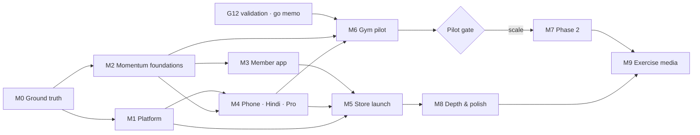

# 23 · Master plan: from today to a finished FitLog

| Field | Value |
|---|---|
| Written | 2026-10-07 |
| Status | **Adopted plan.** Goal status lives on the local board, not in this file |
| Goals | [plan/GOALS.md](plan/GOALS.md): 94 goals, 9 lanes, 10 milestones |
| Board | `node scripts/plan/serve.mjs`, then open http://127.0.0.1:4317. Local only; see [plan/README.md](plan/README.md) |
| Running a goal | [plan/SESSION-PROMPT.md](plan/SESSION-PROMPT.md) |

This document says what is left to build, in what order, by which parallel session, and why. Every
goal is specified once, in [plan/GOALS.md](plan/GOALS.md). The board draws them as a dependency
graph and keeps their status in `docs/plan/status.json`, inside this repo. Nothing is published
anywhere (memory: no-cloud-artifacts).

---

## 1. Sources

The plan was written from four read-only audits on 7 Oct 2026, each checked against the code:

| Audit | Read | Main finding |
|---|---|---|
| v1 launch status | docs 08–13, TODO, README | v1 passed its release gate (G0–G11). Nothing is hosted, iOS was never built, store accounts don't exist. 44 launch-plan boxes are open; most need the owner |
| Gyms v2 | docs 16, 17, R3, code | No gym server code exists. G12–G30 are fully specified in docs/17. The only gym code is an uncommitted preview screen with hard-coded numbers |
| UI directions | docs 15, 18–22, DESIGN.md, PRODUCT.md, memory | Kinetic is committed, Coach OS is uncommitted in the working tree, and **Momentum** (docs/22) is the latest direction, in Figma only. No document records the owner choosing it |
| Code reality | services/api, apps/mobile, CI, infra | 115 API endpoints, 79 screens, about 2,100 tests. Gaps: management actions with no UI, F-04, offline reads, no linter, the AI stub not refused in production, no i18n, no Pro |

The owner's earlier decisions came from memory: Momentum's accent (volt lime, 4 Oct), expressive
over minimal, no cloud artifacts, and the openGym and exercise-media findings (7 Oct).

## 2. Where things stand

- **Built and proven (v1):** training, nutrition, AI food estimates, body metrics, analytics, the
  offline logger, imports, health sync, reminders, export and delete. All 12 v1 acceptance criteria
  are proven; the release gate (G10) and launch readiness (G11) are done.
- **Not done for a store launch:** hosting (staging and production), email, push, store accounts,
  iOS, legal text, store forms, beta.
- **Not started:** phone sign-in (G13), Hindi (G14), Pro (G15), every gym goal (G16–G30), the
  Momentum UI, and the post-launch depth items.
- **Mixed UI state:** see QA-1. It parks or keeps the uncommitted Coach OS work once OW-1 has
  chosen a direction.

## 3. What the plan assumes

1. **Momentum is the UI direction**, pending **OW-1**. If the owner picks another direction, the
   M2/M3 goals keep their shape (tokens → kit → shell → screens) with different values.
2. **G13–G15 land before the store launch.** docs/17:30–32 and charter D33: Pro gates all AI from
   the first public build.
3. **The gym platform runs behind G12.** No G16+ work starts before the go memo (OW-10). The week-8
   and week-13 kill switches still apply (docs/17:391–395). Phase 2 runs only if the pilot gate says
   "scale" (OW-12).
4. **The store launch and the gym pilot run in parallel**, as docs/17's Track A and Track B. They
   share M0–M2 and M4.
5. **Exercise media is the last goal** (owner, 7 Oct 2026). It waits for M7 and M8. If Phase 2 is
   stopped, MS-7 is closed with a note and media goes ahead.
6. **One goal per session**, as in docs/10. A lane runs its goals one at a time; lanes run in
   parallel.

## 4. Milestones

| Gate | Milestone | Exit (short) | Critical chain (by dependency depth) |
|---|---|---|---|
| MS-0 | **M0 Ground truth** | One UI direction; launch decisions; clean green `main`; docs reconciled; lint and coverage gates | OW-1 → QA-1 → QA-2 |
| MS-1 | **M1 Production platform** | Staging and production on the owner's accounts; email, push, real AI, alerts, restore drill | QA-1 → PL-1 → PL-2 → PL-4 → PL-5 |
| MS-2 | **M2 Momentum foundations** | Tokens, type, motion, kit, shell, string catalog | QA-1 → DS-1 → DS-4 → DS-5 |
| MS-3 | **M3 Member app in Momentum** | Every member screen restyled and verified; management UI and F-04 | MS-2 → SC-1 → SC-2 → QA-3 |
| MS-4 | **M4 Launch foundations** | Phone sign-in, Indian food depth, Pro and paywall | PL-2 → AI-1 → G15.api → G15.app |
| MS-5 | **M5 Store launch** | Live on both stores | MS-3 → QA-4 → QA-6 (14-day beta) → QA-7 |
| MS-6 | **M6 Gym pilot** | G16–G23 running in five pilot gyms | OW-10 → G16 → G17 → G18 → G19 → G22 → G23 |
| MS-7 | **M7 Gym Phase 2** | G24–G30, only after the pilot gate | MS-6 → OW-12 → G24 → G26 |
| MS-8 | **M8 Depth and polish** | Progression engine, body map, parity wins, offline reads, barcode, widgets, 80% coverage | MS-5 → AP-3 |
| MS-9 | **M9 Exercise media** | Licensed media in the app; plan complete | MS-7 + MS-8 → OW-14 → AP-9 |

**Wave numbers are not calendar time.** A goal's wave is the length of its longest chain of
needs. Calendar time is set by these long poles, so start them first:

1. **OW-5**, the DLT and Meta registrations: weeks of lead time. G13 and every WhatsApp goal wait on it.
2. **OW-9**, G12 field validation: three weeks or more of interviews, counsel and gym recruitment.
   All gym work waits on it.
3. **OW-1 → QA-1**: every build lane waits on these two. They take a day if the owner decides today.
4. **QA-6**, the Play closed test: 14 continuous days with at least 12 testers. Recruit them
   (OW-8) early.
5. **OW-12**, the pilot: 10 weeks of real use before Phase 2 can start.

## 5. Lanes: the parallel sessions

Each lane is one Claude Code session at a time, started fresh for each goal with
[SESSION-PROMPT.md](plan/SESSION-PROMPT.md). Lanes are split by the files they touch, so parallel
sessions rarely meet in a merge.

| Lane | Charter | Owns (files) | First goals |
|---|---|---|---|
| **You** | Decisions, accounts, money, legal, devices, testers, pilot gyms | — | OW-1, OW-2, OW-9 and OW-5 on day one |
| **S1 Platform** | Hosting, deploy, email, push, store builds, iOS | `.github/`, `infra/`, `scripts/` (deploy), `eas.json`, `app.config.js`, `supabase/` | PL-1 |
| **S2 Backend** | API features: phone identity, Indian food, the gym server halves, payments | `services/api/**` except `app/ai`, `app/billing` | G14.data, G13 |
| **S3 Design** | The Momentum system and the hero screens | `src/theme/`, `src/ui/`, `app/home*`, auth routes, `assets/` | DS-1, DS-2 |
| **S4 Member app** | Strings catalog, Train/Progress/Food screens, post-launch training depth | `src/lib/i18n/`, `app/train/**`, `app/session/**`, `app/progress/**`, `app/nutrition/**` | G14.app |
| **S5 Gym app** | Motion, settings, management UI, every gym client screen | `app/gym/**`, `app/my-gym/**`, `app/visit/**`, `app/join.tsx`, `src/features/{workspace,gym,member-gym}/`, `app/settings/**` | DS-3 |
| **S6 AI & Pro** | AI provider, the accuracy harness, Pro end to end, Phase 2 AI | `services/api/app/ai/`, `app/billing/`, `app/pro/`, `src/features/billing/` | AI-2 |
| **S7 Quality** | Triage, docs, gates, verification, store forms, beta, launch, pilot release | `docs/**`, `.maestro/`, test config | QA-1 |
| **Milestones** | Gate nodes. Mark Done when every need is Done and the exit statement holds | — | — |

**Shared files** (`tokens.ts`, `src/ui/index.tsx`, `ScreenScaffold.tsx`, `TabBar.tsx`, `tabs.ts`,
`app/_layout.tsx`, `src/lib/query/*`, `packages/api-types`) change only inside the goal that owns
them (DS-1…DS-5, the `.api` goals). Any other session that needs a change there writes it in its
handoff, and the owning lane makes it.

**Sync points**, shown as badges on the board:
- **SP1 (DS-5):** the kit and shell are frozen for the screen sessions.
- **SP2 (G14.app):** the catalog and guard ratchet are ready for every screen session.
- **SP3 (each `.api` goal):** migrations, routes and regenerated `packages/api-types` are merged
  before the matching `.app` goal starts. This is docs/17's overlap rule, 17:382–385.

## 6. Order of work, wave by wave

The board computes each goal's earliest wave. In practice:

- **Wave 0, today (owner only):** OW-1 UI direction, OW-2 launch decisions, OW-9 G12 field work,
  OW-13 exercise texts. The build lanes have nothing ready until OW-1 → QA-1 lands.
- **Waves 1–2 (QA-1 lands):** S7 QA-2 and QA-9 · S1 PL-1 · S2 G14.data, then G13 when OW-5 is done ·
  S3 DS-1 and DS-2 · S5 DS-3 · S4 G14.app · S6 AI-2. The owner opens accounts (OW-3, OW-4) and
  starts OW-5 and OW-8.
- **Waves 3–5:** staging and production (S1), the component kit and shell (S3), Pro on the server
  (S6), management UI and F-04 (S5). Gym servers start the moment OW-10 says go.
- **Waves 6–9:** the screen sessions in parallel (S3 heroes and auth, S4 Train/Progress/Food,
  S5 settings), Pro in the app, and the gym client halves following the server halves.
- **Waves 10–13:** device walkthroughs, store forms, the beta and launch (S7) · gym challenges and
  the pilot release.
- **Waves 13+:** the pilot gate, Phase 2 if it says scale, depth and polish after launch, and
  exercise media last.

## 7. Running a goal (summary of SESSION-PROMPT.md)

1. `node scripts/plan/status.mjs ready --lane S3` lists what your lane can start.
2. `node scripts/plan/status.mjs set DS-1 start --who S3 --ref plan/ds-1-tokens` claims it. A
   blocked goal refuses the claim.
3. Read the card in GOALS.md and the docs it names, then work on branch `plan/<id>-<slug>`.
4. Set **In review** when the PR is up, and **Done** when it is merged to `main`. Only Done unblocks
   the goals that wait on it.
5. Append a handoff record to the tracker changelog (docs/09), in the docs/10 §7 shape.

The board (`node scripts/plan/serve.mjs`) shows the same state live. It writes to the same files, so
a status set in a terminal shows on the board within two seconds, and the reverse.

## 8. Status ownership

- **`docs/plan/status.json` owns goal status** for everything in this plan.
- **docs/09 (the tracker) owns evidence:** the changelog, handoff records, measurements and test
  counts. A goal is Done on the board only when its evidence is in the tracker.
- The board does not write the tracker, and the tracker does not write the board. Each goal's close
  updates both (step 5 above).
- Commit `status.json` and `activity.json` with the work they describe, so history shows who moved
  what and when.

## 9. Standing rules for every session

- **TDD:** test first, and see it fail. Mutation-check every guard.
- **Coverage only goes up** (QA-9). Never lower a threshold to pass; the global target is 80% (D18,
  QA-10).
- **Strings:** after G14.app, every screen you touch moves its strings into the catalog, and its
  directory joins the source-scan guard.
- **Momentum rules:** one loud element per screen; volt lime as a container, never a thin line on
  light paper; violet only for the AI coach; motion on springs, with Reduce Motion respected; rewards
  only for real events.
- **Invariants:** I1–I15 from v1 and I16–I24 from docs/17 §3 hold everywhere. AI output is a proposal
  the user confirms.
- **No cloud:** every deliverable is a local file in this repo. Never commit secrets, purchased
  media or user data. The repo is public.
- **Licences:** openGym is AGPL, so copy no code from it. Exercise GIFs are © Gym visual. The rules
  are in memory note opengym-licensing.
- **Performance guardrails:** tap-to-set p95 under 100 ms, under 0.1% of sessions lost to client
  error, and the AI-down containment test passing.

## 10. Doc discrepancies (QA-2 fixes these)

The 7 Oct audit found these disagreements. QA-2 resolves each one or records why it stays:

1. Launch plan "push `main`" is unticked, but the push happened (2 Oct). The green CI run is
   unverified.
2. Tracker G10's "nothing pushed" and docs/10's "first GitHub run waits on a push" are stale.
3. docs/10 G1–G4 done-when boxes are unticked, although the ledger records them closed.
4. docs/10 has no G11 section, ledger row, handoff record or prompt. Its header and scoreboard date
   from 22 Sep.
5. G4's close date is inconsistent (22 vs 23 Sep).
6. Tracker TRK:114: the codegen box is unchecked, but `packages/api-types` exists and is
   drift-gated.
7. Tracker TRK:177: H-14 is unchecked, but it was built in G10.
8. Tracker TRK:172 says Q1 is open. It closed on 25 Sep.
9. Tracker TRK:178: H-17 is "blocked on Q1", but it is v1.1 behind L5.
10. Four different total test counts.
11. The tracker says "Blocked: Nothing", while every remaining item waits on the owner.
12. The launch-plan tick count (46) is out of date: it is now 48 ticked and 44 open.
13. CI has six jobs, not five.
14. L6 / Q6 is closed by D33 but still listed as open in docs/11 and TODO.
15. Charter Q3 still reads as open, although D11 closed it.
16. Charter DR2 was not updated after Q1 closed.
17. The age rule (Q9, 16+) is re-opened for India by Q33, but the store drafts assume 16+.
18. The charter's "no cloud" agreement was never reconciled with D30 hosting.
19. L3's status is unclear (Resend, "built for", no decision row).
20. L4 was executed differently from its recommendation (USDA only, no IFCT).
21. "L8" names two different things: the brand, and a security finding.
22. docs/12 says `/metrics` is not locked down. It is; only the scrape is open.
23. docs/12 says the API does not set HSTS. It does, when deployed.
24. docs/12 names Sentry RN 6.10. It is 7.11 since SDK 57.
25. docs/13 says `app.json`; the config is `app.config.js`.
26. There are two names for the deletion path (docs/13 vs docs/11). Check that they are the same.
27. docs/README stops at D30 and "eleven goals". It does not index docs 18–20.
28. The charter's delivery goal "MVP on iOS and Android" is unmet, because iOS was never built.
29. The charter's release DoD means the G10 gate, not a store release. Say so.

The gym docs add three more:
- Which visits count for standings: 16:600 vs 16:604. The owner decides.
- The pilot runbook name collides with docs/18. Rename it to docs/24.
- Owner tab labels differ across docs. Use docs/22's set.

## 11. Open decisions, mapped to goals

| Decision | Goal | Default if unanswered |
|---|---|---|
| UI direction, the Coach OS diff, the green rule, navigation | OW-1 | Momentum; park Coach OS; no green |
| L2 host, L3 email, L5 barcode, L7 scope, L8 name, PITR, Sentry region, photo backups | OW-2 | Recommendations in docs/11 Phase 0 |
| Q24 SMS provider, Q23 WhatsApp number | OW-5 | MSG91 through the Supabase hook; the platform number |
| Q26 member Pro price, Q25 purchase stack | OW-7 | ₹149 a month / ₹999 a year, 7-day trial; RevenueCat |
| Q9 / Q33 minimum age | OW-6, OW-9 | 18+ for India, confirmed by counsel |
| Q21–Q32 (gyms) | OW-9 → OW-10 | docs/16 §16 defaults |
| Visit eligibility for standings | QA-2 → owner | `verified` / `staff` / `device` (docs/17) |
| Q31 payment aggregator | OW-12 | Razorpay or Cashfree sub-merchant |
| Exercise media source | OW-14 (last) | RepDB community edition (free, credit required) |

## 12. Backlog: kept, not scheduled

These stay out of the graph until the owner promotes one. Promoting means adding a card to GOALS.md
and running `node scripts/plan/build.mjs`.

- **From the launch plan's [Later] list:**
  - exercise substitutions
  - offline-first sync of every entity
  - micronutrients
  - personalised nutrition
  - a natural-language assistant
  - a member web app
  - sleep and recovery from wearables
  - Apple Watch and Wear OS
- **Left over from G8:** an in-app camera, several photos per analysis, dictation on H-06.
- **From docs/16:** WhatsApp OTP (A01.5), regional languages (L01.6), background-location check-in
  (GYM06.10), volume and lift challenges and kudos (GYM11.4), automatic referral rewards (GYM12.3),
  gym-bought seats (Q29).
- **P3 (G31+):** ads under D35's rules, partnerships, city events, inter-gym challenges, the
  marketplace.
