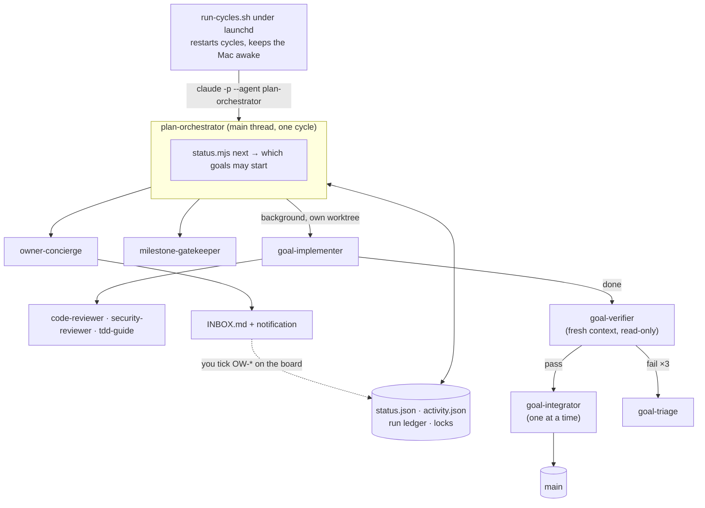

# Autonomous execution: one orchestrator, many agents

| Field | Value |
|---|---|
| Written | 2026-10-08 |
| Status | **Approved 8 Oct 2026. O1 (agents and skills) is written**; O2–O5 are not built yet |
| Drives | The 94-goal plan in [GOALS.md](GOALS.md), with statuses in `status.json` |
| Runs | Locally, on the owner's machine. Nothing is published |

## 1. The short answer

**Yes, the plan can run on its own: one orchestrator dispatching sub-agents goal by goal, deciding
what to run and when, and recovering from failures without a person watching.**

**No system can run all 94 goals without stopping.** The graph itself contains things no agent may
do:
- **Money:** store accounts, Supabase Pro.
- **Law:** counsel review, the privacy policy.
- **Identity:** DLT and Meta registration.
- **Physical devices:** an iPhone, a smart scale, a ₹8–10k reference phone.
- **Other humans:** 12 beta testers for 14 days, five pilot gyms for 10 weeks.

What the system *can* guarantee:

1. **It never stops while there is runnable work.** A failed or blocked goal parks itself and the
   rest of the graph keeps moving.
2. **It never stalls silently.** Anything that needs a person lands in an owner inbox, with a
   notification and exact instructions.
3. **It resumes by itself** after a crash, a reboot, a usage limit, a rate limit, or the moment you
   tick an owner goal.
4. **It never takes an outward-facing action on its own**, such as deploying to production,
   submitting to a store, spending money or emailing anyone. Those become inbox items.

## 2. What the graph allows

Each goal was classified by what it needs to finish:

| Class | Goals | What it means |
|---:|---:|---|
| **Autonomous** | 47 | Code, tests, emulator flows and docs. An agent can finish it alone |
| **Autonomous once you supply something** | 14 | It needs your accounts, secrets or one approval, then an agent runs it (e.g. PL-2 staging, G13 phone OTP, PL-7 store build) |
| **Needs a device, people or calendar time** | 9 | iPhone proof, beta, pilot, TalkBack on a phone (e.g. PL-8, QA-4, QA-6, G23) |
| **Owner only** | 14 | Decisions, accounts, legal, testers, pilot gyms (the `OW-*` lane) |
| **Milestone gates** | 10 | Checked automatically against their exit statements |

The autonomous goals come in four long stretches. Each starts the moment a human gate opens, then
runs without anyone:

| Stretch | Opens when | Runs on its own | About |
|---|---|---|---|
| **A · Momentum and the member app** | OW-1 (UI direction) is done | QA-1 → QA-2, QA-9 · DS-1…DS-5 · G14.app, G14.data · SC-1…SC-7 · AP-1, AP-2 | 19 goals |
| **B · The gym MVP** | OW-10 (G12 go) and OW-11 (Meta templates) are done | G16…G22, both the `.api` and `.app` halves | 14 goals |
| **C · Depth after launch** | MS-5 (store launch) is done | AP-3…AP-8, QA-10 | 7 goals |
| **D · Gym Phase 2** | OW-12 says "scale" | G24, G25, G27, G28, G29 | 6 goals |

**The single biggest lever is front-loading your decisions.** Stretch A cannot begin until OW-1 is
answered, and much of M1 waits on OW-2 and OW-3. The orchestrator prepares a **decision pack** on
its first run: every open decision, with the recommended default and a one-line consequence. One
sitting with it unblocks most of the graph.

## 3. Architecture: a Claude Code orchestrator with sub-agents

The orchestrator is itself a Claude Code agent, and every role under it is a defined sub-agent. Each
concern uses the Claude Code feature built for it:

| Layer | Claude Code feature | Lives in | Job |
|---|---|---|---|
| **Roles** | Sub-agent definitions | `.claude/agents/*.md`, checked in | Who does what, with which tools, model and effort |
| **Procedures** | Skills | `.claude/skills/*/SKILL.md` | How each role does its job: the playbooks |
| **Rules that must always hold** | Hooks and permission settings | `.claude/settings.json` and each agent's `hooks:` | Block dangerous commands, record results, refuse to finish without evidence |
| **Facts** | Plain code | `scripts/plan/` (already built) | What is Ready, what is locked, what each run did |
| **Keep-alive** | Headless mode under launchd | `scripts/orchestrator/run-cycles.sh` | Start the next orchestrator cycle, forever |



### The agents

| Agent | Started by | Tools (only what the role needs) | Model · effort | Notes |
|---|---|---|---|---|
| `plan-orchestrator` | the runner, as the main thread (`claude -p --agent plan-orchestrator`) | Read, Grep, Glob, Agent. Bash only for `node scripts/plan/*` and read-only git | Opus 5.5 · high | Never edits product code. Delegates every goal. Starts goals only from `status.mjs next` output |
| `goal-implementer` | the orchestrator, in the background | Read, Edit, Write, Agent, allowlisted Bash | Opus 5.5 · high (xhigh for L goals) | `isolation: worktree` for now; O2 moves it to a fixed worktree per goal (§6). Preloads the `run-goal` skill. Starts the reviewers |
| `code-reviewer`, `security-reviewer`, `tdd-guide` | the implementer | Read, Grep, Glob, Bash for tests only | Opus 5.5 · high | Review the diff in a fresh context. Your global rules name these agents, but `~/.claude/agents/` doesn't exist, so they get defined here |
| `goal-verifier` | the orchestrator, after the implementer | Read, Grep, Glob, Bash for tests and read-only git. **No Edit or Write** | Opus 5.5 · high | Sees only the diff and the card, not the implementer's reasoning. Returns a verdict in a fixed shape |
| `goal-integrator` | the orchestrator, one at a time | Read, Bash for git and the test runners | Opus 5.5 · medium | Rebases, runs the full suite, merges, sets the goal Done |
| `goal-triage` | the orchestrator, after repeated failure | Read, Grep, Glob | Opus 5.5 · high | Decides: retry with guidance, split, hold, or escalate |
| `milestone-gatekeeper` | the orchestrator, when a gate's needs are done | Read, Grep, Glob, Bash for tests | Opus 5.5 · high | Checks the milestone's exit statement |
| `owner-concierge` | the orchestrator, when only human goals are Ready | Read; Write limited to `docs/plan/INBOX.md` and `docs/plan/owner-packs/` | Opus 5.5 · medium | Writes the decision pack and inbox, and prepares owner work |

The deepest chain is orchestrator → implementer → reviewer: two levels, inside Claude Code's limit
of three. Every agent can also be run by hand (`claude --agent goal-verifier`), which is how each one
is tested before the system runs on its own.

### The skills

| Skill | Used by | Holds |
|---|---|---|
| `run-plan` | `plan-orchestrator` | The cycle below, the retry and escalation rules, the ledger format |
| `run-goal` | `goal-implementer` | Today's `SESSION-PROMPT.md`, turned into a skill: entry gate, TDD, standing rules, handoff format |
| `verify-goal` | `goal-verifier`, `milestone-gatekeeper` | How to check each Done-when box against real evidence; the verdict shape |
| `integrate-goal` | `goal-integrator` | Rebase, gates, merge, close-out, tracker handoff |

Agent files stay short (role, boundaries, outputs). Procedures live in skills, which load only when
the role needs them.

### One orchestrator cycle

1. A `SessionStart` hook loads the current state: `status.mjs summary` plus the ledger's open runs.
2. **Reconcile.** Finished runs not yet verified or merged continue from where they stopped. A
   worktree whose implementer died gets a new implementer that resumes from the goal's checkpoint
   file.
3. **Pick.** `node scripts/plan/status.mjs next --slots 3` returns the goals that may start now. It
   applies the rules in §4 in code, so the agent never judges readiness by itself.
4. **Dispatch.** Claim each goal, then start a `goal-implementer` in the background in its own
   worktree.
5. **Collect.** As each finishes, a `SubagentStop` hook has already refused to let it stop without a
   handoff file and evidence. Then `goal-verifier` runs:
   - on **pass**, the goal joins the integrator queue;
   - on **fail**, it gets another attempt carrying the verifier's reasons;
   - after three failures, `goal-triage` decides what happens.
6. **Gates.** Any milestone whose needs are all Done goes to `milestone-gatekeeper`.
7. **People.** If only human goals are Ready, `owner-concierge` updates the inbox and a notification
   goes out.
8. **End the cycle** when nothing is running and nothing more can start, writing a cycle summary to
   the ledger. The runner starts the next cycle at once if work is Ready, otherwise after a sleep.

**Why cycles, not one endless session.** Claude Code's own guidance is that context is the
fundamental constraint. A session told to "keep going" for weeks fills its context and degrades.
Each cycle starts clean and rebuilds its picture from files, so the system can run for months. A crash
costs at most one cycle's bookkeeping, never work: the work lives in worktrees, checkpoints and
`status.json`.

**Why readiness is code.** Claude Code's guidance is to use hooks and code for anything that must
happen every time with no exceptions. Whether a goal may start is that kind of rule. The orchestrator
agent decides *how* to handle what `next` returns, never *whether* a goal is ready.

The implementer never marks its own goal Done. Only a passing verifier plus a clean merge does. That
is the safeguard against agents compounding each other's mistakes over 60 goals.

## 4. How it decides when to run and when not to

`status.mjs next` applies these rules in code, in order, every time the orchestrator asks:

**Run a goal only if all of these hold:**
1. Every need is Done. This is the same derived "Ready" the board shows.
2. Its lane has no goal running (one session per lane, per docs/23 §5).
3. The global cap allows another session (default **3** implementers at once).
4. It is not a human goal (the `You` lane, or classed as needing a device or people).
5. Its attempt count is under the limit (default **3**), and today's budget is not spent.
6. No running goal holds a resource it needs: the Android emulator, the local Supabase stack, or a
   shared file listed in docs/23 §5.
7. `main` is green.

**Priority among Ready goals:** the longest remaining chain first. That is the critical path to the
next milestone; with the current graph it means DS-1 → DS-4 → DS-5 before anything that waits on
MS-2. Ties go to the goal that unblocks the most others.

**When nothing should run:**

| Situation | What happens |
|---|---|
| `main` is red | **Stop the line.** No new dispatches; one fix-main goal runs until it is green |
| A usage or rate limit is hit | Sleep until the stated reset time, or back off exponentially when none is given. **No attempt is spent** |
| The budget cap for the day is reached | Sleep until tomorrow; report in the digest |
| Only human goals are Ready | Write the inbox, notify once, then sleep until `status.json` changes |
| A goal fails three times | `goal-triage` decides; if it cannot be retried it goes **On hold** and into the inbox, and the rest carries on |
| You create `var/orchestrator/STOP` | The current cycle finishes its running goals, starts nothing new, and the runner exits |

## 5. Staying up non-stop

| What can stop it | How the design survives it |
|---|---|
| A cycle crashes | launchd `KeepAlive` restarts the runner. The next cycle reconciles the ledger and resumes any goal mid-phase from its worktree and checkpoint |
| The Mac sleeps or reboots | `caffeinate -i` while running; launchd `RunAtLoad` after a reboot. Best is an always-on machine (a Mac mini) left plugged in |
| Context fills up | The orchestrator starts every cycle fresh. Each goal phase is its own sub-agent with its own context. L goals checkpoint after each step |
| A usage limit (subscription) or rate limit (API) | Detected from the error, then sleep until reset. Limits pause work; they never fail goals |
| An agent loops or hangs | `maxTurns` on every agent definition, a wall-clock timeout per cycle, and `--max-budget-usd` on each cycle; then triage |
| Tests or the verifier fail | Up to 3 attempts, each given the verifier's reasons; then On hold, inbox, and the graph moves on |
| Merge conflicts | One serialized merge queue. A conflict goes back to the implementer with the diff, as a fresh attempt |
| Two goals collide on a resource | Locks per resource: emulator, Supabase stack, shared files. Per-goal test databases (`TEST_DATABASE_URL` already exists in `app/config.py`) and per-goal ports |
| A permission prompt with nobody there | No prompts at all: each agent's `tools` list, the project allowlist, `permissionMode: dontAsk`, and a `PreToolUse` guard hook. Anything not allowed is denied and reported, never waited on |
| Quality drifting over many goals | Independent verifier, CI gates, the coverage ratchet (QA-9), milestone gate reviews, and the daily digest |
| An owner gate is waiting | Inbox plus notification, then sleep. Your tick on the board wakes it within seconds |

## 6. Breaks, resumes and rollbacks

**Principle: nothing important lives only in an agent's memory.** All state sits in one of four
durable places, and every step can be repeated without doing harm.

| State | Where it lives | What it survives |
|---|---|---|
| **The work** | The goal's branch in its worktree `.claude/worktrees/<ID>`, committed after every step, plus `docs/plan/runs/<ID>/checkpoint.md` | Crashes, reboots, killed agents |
| **What the system was doing** | The run ledger `var/orchestrator/ledger.jsonl`. It is append-only: one event before each step starts and one after it ends, never edited | The same |
| **Status** | `status.json` and `activity.json`: written under a lock, flushed to disk, and committed with every merge | The same, plus git history |
| **Agent conversations** | Claude Code's transcripts, with every session id and sub-agent id recorded in the ledger | Used to resume a conversation; nothing *depends* on them |

### Every goal attempt is a state machine

```
claimed → implementing → implemented → verifying → verified → integrating → merged → closed
              │                            │ fail: next attempt     │ conflict or failing gates: next attempt
              └── interrupted              └── interrupted          └── interrupted (recovery below)
```

Each arrow is two ledger events:
- the **intent**, written before the step, with what is needed to redo or undo it (`main`'s commit,
  the worktree, the session ids);
- the **result**, written after it.

A step with an intent and no result was interrupted, and the next cycle knows exactly where.

### When something breaks mid-session

| It breaks during | On restart | What is lost |
|---|---|---|
| **implementing** | Tier 1: resume the same agent conversation. Tier 2: a new implementer in the same worktree, starting from the last checkpoint commit | At most the work since the last checkpoint: one scope step |
| **verifying** | Run the verifier again. It changes nothing, so repeating it is safe | Nothing |
| **integrating, mid-rebase** | `git rebase --abort` in the worktree, then integrate from the start | Nothing; `main` was untouched |
| **integrating, after the fast-forward but before Done** | `git merge-base --is-ancestor` shows `main` already holds the branch. Finish the remaining steps only: Done, tracker, clean-up | Nothing, and no double merge |
| **integrating, after Done but before the tracker commit** | The tracker entry carries a marker `<!-- handoff:<ID>:<commit> -->`, so it is appended only if absent and committed only if something is staged | Nothing, and no double entry |
| **the orchestrator cycle** | The runner sees a cycle that started and never ended. Tier 1 resumes that orchestrator session; Tier 2 starts a fresh cycle that reconciles from the ledger | Nothing |
| **a usage limit** | The runner sleeps until the reset, then resumes with Tier 1 | Nothing, and no attempt spent |
| **a reboot or power loss** | launchd restarts the runner: the same as a crashed cycle. Status and ledger writes are atomic and flushed to disk | Nothing beyond the last checkpoint |

**Crashes and limits count as interruptions, not attempts.** Only a failed verification or merge uses
up an attempt. A goal interrupted five times goes to triage, because something in it is killing the
run (a test that hangs, for example).

### Two tiers of resume

- **Tier 1, the conversation continues.** The ledger records each cycle's session id, and each
  sub-agent's id and transcript path (from the `SubagentStart` and `SubagentStop` hooks).
  - An interrupted cycle is resumed with `claude -p --resume <session-id> --agent plan-orchestrator`,
    told that the cycle was interrupted and should reconcile and continue.
  - Inside a live cycle, a sub-agent that ran out of turns is continued with a message to its id,
    which resumes it from its transcript.

  The agent keeps everything it knew.
- **Tier 2, rebuild from files.** If a transcript is missing, damaged or stale, a fresh agent starts
  from the branch, the checkpoint, the handoff and the ledger. It is slower, but it always works, and
  it is what the system **relies on**. Tier 1 is a speed-up that O4's drills must prove before it is
  trusted.

**A fixed worktree per goal makes this possible.** The tooling (O2) creates each goal's worktree at a
fixed path, `.claude/worktrees/<ID>` on branch `plan/<id>-<slug>`, and reuses it on every attempt and
resume. That replaces `isolation: worktree`, whose location and clean-up Claude Code chooses. A new
agent can find its predecessor's work only if the path is fixed. The O2 guard hook takes over
isolation's other job: keeping the agent inside its worktree.

### Rollbacks

| What to undo | How | Never |
|---|---|---|
| **A bad attempt**, before it merges | Tag the attempt's branch head `attempt/<ID>/<n>`, then reset the branch to the last good checkpoint, or recreate the worktree from `main`. Nothing is thrown away | Delete commits |
| **A merged goal that turns out wrong** | The ledger stores `main` before and after every merge. `rollback <ID>` runs `git revert` over exactly that range: new commits that undo the goal, with history intact. The goal returns to Not started (or On hold) with the reason, and every later goal that needs it is listed for triage | `git reset --hard` or a force-push on `main` |
| **Back to a known-good milestone** | Each passing gate tags `main` as `ms/<MS-ID>`. Diff, bisect or revert back to it | Rewriting history |
| **A database migration** | Migrations must be reversible (a standing rule), so a rollback includes `alembic downgrade` to the revision before the goal | — |
| **Production** | Already an owner gate. `deploy.yml` rolls back by redeploying an older image | An automatic production rollback |
| **A wrong status** | `status.mjs set` it back with a note. `activity.json` keeps the trail | Editing `activity.json` |

### You in control: pause, take over, resume

A small control command, `node scripts/orchestrator/ctl.mjs` (O4):

| Command | What it does |
|---|---|
| `start` | Loads the launchd job: cycles run back to back until the plan is done, and survive reboots |
| `cycle` | Runs one cycle in this terminal and then stops. Use it for watching or testing |
| `stop` | Unloads the launchd job after the current cycle. Nothing runs until `start` |
| `status` | Every open run: goal, step, attempt, worktree, last checkpoint, cost so far |
| `pause` | Writes the `STOP` file. Running steps finish; nothing new starts |
| `pause --now` | Stops the cycle at once. Safe, because everything resumes from the ledger |
| `resume` | Removes `STOP`. The runner continues where it left off |
| `takeover <ID>` | Marks the goal as yours, and the orchestrator leaves it alone. Open its worktree and type `/run-goal <ID>`: it continues from the checkpoint on the same branch |
| `release <ID>` | Hands the goal back to the orchestrator |
| `retry <ID>` | Starts a fresh attempt, keeping the old one tagged |
| `rollback <ID>` | Shows what it would revert and which goals depend on it, asks for a yes, then reverts |

Sessions you run by hand recover the same way:
- `claude --continue` or `claude --resume` brings the conversation back;
- `/run-goal <ID>` brings the work back from the checkpoint, even in a brand-new session.

## 7. Safety

- **Allowed by default:** edits inside the goal's worktree; `pnpm`, `uv`, `pytest`, `jest`, `node`,
  Maestro on the emulator; `git` on the goal's own branch.
- **Denied outright**, by the `PreToolUse` guard (exit code 2 blocks the command):
  - `git push --force`, and any push to `main` from a goal session
  - `eas submit`, store uploads, production deploy hooks
  - payments, sending email or SMS to real people
  - `rm -rf` outside the worktree, and reading secret files
- **Owner gates, never automatic:** production deploys (PL-4), store submissions (PL-7, PL-8,
  QA-5, QA-7), anything that spends money, legal text, and **pushing `main` to GitHub**. Your repo is
  public, so an automatic push needs your explicit yes first (decision 3 below).
- **Never bypassed:** permission checks. Your rules forbid skipping them, so agents run with
  `permissionMode: dontAsk`, which denies anything not on the allowlist instead of asking.
- **Least privilege per role:** the verifier, triage and gatekeeper cannot edit files at all. The
  orchestrator cannot edit product code. Only the implementer writes code, and only in its own worktree.
- **Budgets:** a cap per cycle (`--max-budget-usd`), a turn limit per agent (`maxTurns`), a cap per
  day, and the cost of every goal recorded in the ledger and the digest.
- **Kill switch:** the `STOP` file, or put a lane On hold on the board.

## 8. The technology

**Native Claude Code throughout**, with no separate framework:

- **Sub-agent definitions** in `.claude/agents/`: `tools`, `disallowedTools`, `model`, `effort`,
  `permissionMode`, `maxTurns`, `skills`, `hooks` and `isolation: worktree`.
- **`claude -p --agent plan-orchestrator`** runs a whole headless session as the orchestrator agent.
- **Background sub-agents** with worktree isolation run several goals in parallel; each completion
  comes back to the orchestrator as a notification.
- **Hooks:**
  - `SessionStart` loads the state;
  - `PreToolUse` guards commands;
  - `SubagentStop` refuses to let an implementer stop without its handoff, and records results in the
    ledger.
- **The existing `scripts/plan/` tooling** is the source of truth. The board shows everything live,
  and its write lock already handles parallel writers.

It is also the same harness your interactive sessions use (`CLAUDE.md`, your rules, RTK), so the
agents behave like the sessions you already trust.

**Considered and not chosen:**

| Option | Why not, for this job |
|---|---|
| Agent teams | Experimental, interactive only (not available headless), and teammates are not restored on resume. Wrong fit for an unattended run |
| The Workflow tool | Excellent for fanning a script out over many agents inside one session, but its resume works only within the same session. It could later run the inside of one cycle; the outer loop still needs to survive restarts |
| The Claude Agent SDK as a library | The same engine underneath. `--agent` plus sub-agent files gives the same result with less code you own |
| Scheduled cloud routines, or Managed Agents | They run in Anthropic's cloud. You want everything local, and the Android emulator and local Supabase need this machine |

**Authentication.** Use an API key (`ANTHROPIC_API_KEY`) or a long-lived token from your
subscription (`claude setup-token` → `CLAUDE_CODE_OAUTH_TOKEN`):
- With a subscription, the session and weekly limits pause the run whenever they are reached. Section 5
  handles that.
- With an API key, the run never pauses for limits, but every token is billed.

**Models.** Claude Opus 5.5 for every role by default, with effort set per role in each agent file.
Cheaper models for the verifier or the concierge would trade quality for cost; that is your call.

## 9. You in the loop

- **The owner inbox** is `docs/plan/INBOX.md`, kept local and current by `owner-concierge`. It lists each
  item: what is blocked, why it matters (how many goals wait on it), exactly what to do, and the
  default if you just say "go".
- **A notification** goes out once per new item (macOS notification) and once per day for the digest.
- **Prepared work, not blank tasks:**
  - before OW-6 (legal), an agent drafts the policy text for counsel;
  - before QA-5, it pre-fills every store form;
  - before OW-3, it writes a click-by-click account checklist.

  You approve and execute; the agent did the typing.
- **Answering** is what you already do: tick the goal on the board or run `status.mjs set OW-1 done`.
  The next cycle picks it up; a sleeping runner checks every minute.

## 10. Cost and time, measured rather than guessed

There is no honest number until the pilot run (O5 below) has measured a few goals. The pilot runs
three goals of different sizes, records cost and wall time per phase, and extrapolates to the 61
goals agents can run.

Until then, plan as follows:
- **Per-goal caps:** S $10, M $30, L $90.
- **A daily cap you choose.**
- **Three goals in parallel** to start. Early waves have up to seven lanes with Ready work, so raise
  the cap once the pilot shows your machine and limits can take more.

Calendar time is set by the human gates and the external waits (DLT and Meta: weeks; Play beta:
14 days; pilot: 10 weeks), not by the agents.

## 11. Building it: phases

These can become cards in GOALS.md, in their own lane, once you approve the design.

| Phase | Builds | Done when |
|---|---|---|
| **O0 · Prerequisites** (you) | Answer the decisions in §12, set up auth, `gh auth login`, an always-on machine or `caffeinate` | Each answer is written down |
| **O1 · Agents and skills** | The ten agent files and four skills above (`run-goal` replaces pasting `SESSION-PROMPT.md`) | Each agent, run by hand with `claude --agent <name>` on a sample goal, keeps to its contract. The verifier rejects a planted false claim; the read-only agents fail to edit when they try |
| **O2 · Facts and safety** | `status.mjs next` (every rule in §4); the run ledger as the §6 state machine, with intent and result events, and attempts counted apart from interruptions; fixed worktrees per goal; resource locks with stale-lease detection; per-goal test databases and ports; the `PreToolUse` guard; the `SessionStart`, `SubagentStart` and `SubagentStop` hooks; the project allowlist | Tests prove each rule and each blocked command. Two worktrees run `pytest` at once without colliding. Replaying the ledger after a simulated crash at any event reaches the same state |
| **O3 · Orchestrator cycle** | `plan-orchestrator` with the `run-plan` skill, plus a **dry-run mode** in which stub agents stand in for real ones | A dry run walks the graph to every gate it can reach, keeping every rule in §4 and §5 |
| **O4 · Runner, recovery and limits** | `run-cycles.sh` under launchd with `caffeinate`; Tier 1 resume (`--resume`) with fallback to Tier 2; usage-limit sleep; `ctl.mjs` (status, pause, resume, takeover, release, retry, rollback); milestone tags; logs under `var/orchestrator/` | **Kill drills:** the cycle is killed while implementing, while verifying, mid-rebase, after the fast-forward and after Done, and a reboot is simulated. Each time the goal finishes with no lost commits, no double merge and no double tracker entry. A limit pauses and resumes without spending an attempt. `rollback` of a merged goal reverts exactly its commits |
| **O5 · Pilot** | Run QA-9 (S), DS-1 (M) and G14.data (M) with you watching; measure | The three goals are merged, cost and time are recorded here, and you switch on continuous mode |

O1–O4 are built the same way as any other goal, with tests. O5 is the point where you decide whether
to let it run.

### Where the build stands

- **O1, written 8 Oct 2026.**
  - Ten agents are in `.claude/agents/`: `plan-orchestrator`, `goal-implementer`, `goal-verifier`,
    `goal-integrator`, `goal-triage`, `milestone-gatekeeper`, `owner-concierge`, `code-reviewer`,
    `security-reviewer` and `tdd-guide`.
  - Four skills are in `.claude/skills/`: `run-plan`, `run-goal`, `verify-goal` and `integrate-goal`.
  - Their frontmatter parses; every referenced skill and every agent the orchestrator may spawn
    exists.
  - A headless smoke test (`claude -p --agent goal-triage`) loaded the definition. It ran on
    `claude-opus-5-5` with only Read, Grep and Glob, as specified.
  - Still open for O1's Done-when: the by-hand contract runs. Those are: each agent on a sample goal,
    the verifier rejecting a planted false claim, and the read-only agents failing to edit.
  - Until O2 exists, the orchestrator runs in **advisory mode**. It reports what it would start and
    starts nothing.
- **O1 turned up these extra items for O2:**
  1. Make `scripts/plan/` resolve the **main checkout's** `docs/plan` when run inside a worktree. A
     worktree's `status.json` is only a snapshot from when it branched.
  2. Run orchestrator sessions with only the MCP servers they need (`--strict-mcp-config`). Today
     every agent inherits all your user-level connectors (Figma, Gmail, …) and waits for them to
     connect.
  3. Add guard hooks that enforce in code what the prompts ask for:
     - read-only Bash for the verifier, gatekeeper and orchestrator;
     - the integrator may edit only `docs/09`;
     - the concierge may edit only the inbox and owner packs.
  4. Set `permissionMode: dontAsk` on each agent once the project allowlist exists. Until then,
     running an agent by hand asks for permission as usual.

## 12. Decisions needed from you

1. **Approve this design**, or change it, before anything is built.
2. **Auth:** an API key (billed per token, no pauses) or a subscription token (limits pause the run).
3. **Pushing to GitHub:**
   - (a) the integrator pushes `main` after each merge, so GitHub CI checks everything; or
   - (b) `main` stays local until you push.

   The repo is public, so (a) publishes code continuously.
4. **Concurrency** (default 3) and a **daily budget cap**.
5. **Where it runs:** this Mac kept awake, or a dedicated always-on machine.
6. **Answer the decision pack** (OW-1 and OW-2 at minimum) the first time it appears. Without
   OW-1, no autonomous stretch can start.
